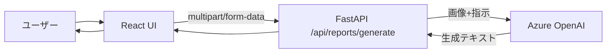

# 技術設計

## 1. 構成概要
- フロントエンド: React + Vite
- バックエンド: FastAPI
- AI: Azure OpenAI Chat Completions（画像入力を含む）

## 2. アーキテクチャ


## 3. データフロー
1. ユーザーが画像を選択して送信。
2. Reactが `FormData` でバックエンドにPOST。
3. FastAPIがファイル形式・サイズを検証。
4. FastAPIが画像をbase64化してAzure OpenAIへ送信。
5. モデル応答から日報本文を抽出。
6. フロントエンドがテキストを表示し、編集とコピーを可能にする。

## 4. APIインターフェース
### POST `/api/reports/generate`
- Request: `multipart/form-data`
  - `image`: `image/png` または `image/jpeg`
- Response 200:
```json
{
  "report": "# 作業内容\n..."
}
```
- Error:
  - 400: 画像形式不正
  - 413: 容量超過
  - 500: 設定不備
  - 502: Azure OpenAI呼び出し失敗

## 5. データモデル
- 永続DBは使用しない。
- 処理はリクエスト単位で完結。

## 6. エラーハンドリング方針
- 期待される入力エラーは `HTTPException` で明示。
- 外部サービスエラーは502でラップ。
- ログにはキー、認証ヘッダ、画像本体を出力しない。

## 7. テスト方針
- バックエンド:
  - 入力バリデーション単体テスト（形式・容量）
- フロントエンド:
  - 主要操作の手動確認（アップロード、ローディング、表示、コピー）

## 8. 実装上の考慮
- Azure OpenAI SDKは `openai` を使用し、`base_url` をAzure endpointに設定する。
- モデル呼び出しはデプロイメント名を `model` に指定する。
- CORSは開発時に `http://localhost:5173` を許可する。
